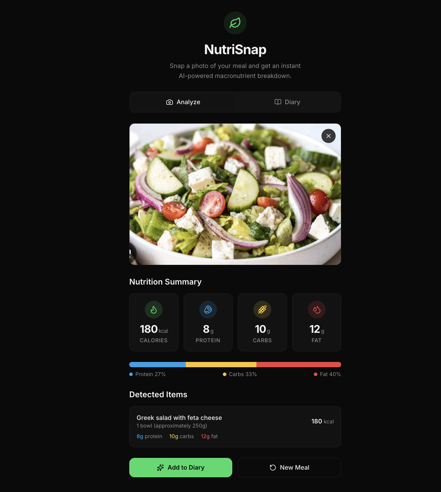
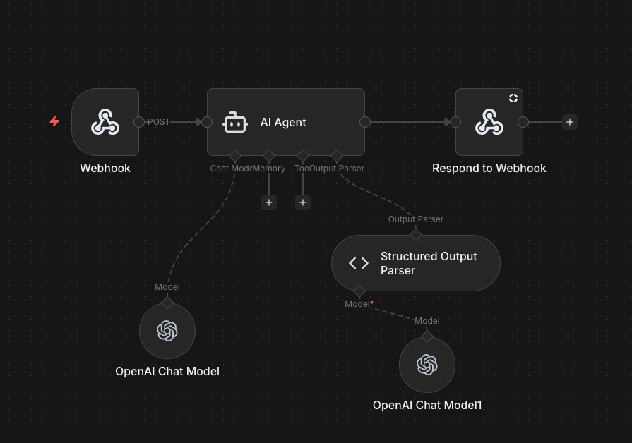

# NutriSnap 🍽️

**AI-Powered Meal Tracking**

NutriSnap is a Next.js web application that analyzes food photos and provides instant nutritional breakdowns powered by AI. Simply snap a photo of your meal and get detailed macronutrient information along with a daily food diary to track your eating habits.





---

## ✨ Features

- **Photo Upload** - Upload meal photos via drag-and-drop or file picker
- **AI Analysis** - Powered by OpenAI GPT-4 Vision for accurate food recognition
- **Nutritional Breakdown** - Get detailed macros (calories, protein, carbs, fat) for each food item
- **Daily Diary** - Track all your meals throughout the day with timestamps
- **Running Totals** - See your daily nutritional totals at a glance
- **Visual Macro Distribution** - Color-coded bar chart showing macro balance
---

## 🏗️ Architecture

NutriSnap uses a modern serverless architecture:

```
┌─────────────┐      ┌──────────────┐      ┌─────────────┐
│   Next.js   │ ───> │  n8n Webhook │ ───> │  OpenAI API │
│  Frontend   │      │   Workflow   │      │  (GPT-4V)   │
└─────────────┘      └──────────────┘      └─────────────┘
```

1. **Frontend**: Next.js 16 with React 19 and TypeScript
2. **Backend API**: Next.js API route proxies image to n8n
3. **n8n Workflow**: Processes image and orchestrates AI analysis
4. **OpenAI**: GPT-4 Vision analyzes food and returns structured JSON

---

## 🚀 Getting Started

### Prerequisites

- **Node.js** 18+ or 20+
- **pnpm** (recommended) or npm
- **n8n account** with webhook access
- **OpenAI API key**

### Installation

1. **Clone the repository**
   ```bash
   git clone <repository-url>
   cd meal-photo-analytics
   ```

2. **Install dependencies**
   ```bash
   pnpm install
   ```

3. **Set up n8n workflow**
   - Paste the provided Meal-Analyzer-n8n.json into your n8n instance
   - Configure your OpenAI API credentials in n8n
   - Note your webhook URL (e.g., `https://your-instance.app.n8n.cloud/webhook/meal-ai`)

4. **Update webhook URL**
   
   Edit `app/api/analyze/route.ts` and update the webhook URL:
   ```typescript
   const response = await fetch(
     "https://YOUR-WEBHOOK-URL-HERE",
     // ...
   );
   ```

5. **Run the development server**
   ```bash
   pnpm dev
   ```

6. **Open your browser**
   
   Navigate to [http://localhost:3000](http://localhost:3000)

---

## 📋 n8n Workflow Setup

The n8n workflow processes meal photos through these steps:

1. **Webhook** - Receives image upload from Next.js app
2. **AI Agent** - Analyzes food using OpenAI GPT-4 Vision
3. **Structured Output Parser** - Ensures consistent JSON format
4. **Respond to Webhook** - Returns nutritional data to the app

### Required JSON Response Format

The n8n workflow must return data in this format:

```json
{
  "food": [
    {
      "name": "Grilled Chicken Breast",
      "quantity": "6 oz",
      "calories": 280,
      "protein": 53,
      "carbs": 0,
      "fat": 6
    }
  ],
  "total": {
    "calories": 280,
    "protein": 53,
    "carbs": 0,
    "fat": 6
  }
}
```

### n8n Configuration Tips

- **Webhook Node**: Set to accept POST requests
- **AI Agent**: Enable "Passthrough Binary Images" option
- **Structured Output Parser**: Use the provided JSON schema
- **Respond to Webhook**: Set "Respond With" to "First Incoming Item"

---

## 🛠️ Tech Stack

### Frontend
- **Next.js 16** - React framework with App Router
- **React 19** - UI library
- **TypeScript** - Type safety
- **Tailwind CSS** - Styling
- **shadcn/ui** - UI component library
- **Lucide React** - Icons

### Backend
- **Next.js API Routes** - Serverless functions
- **n8n** - Workflow automation
- **OpenAI GPT-4 Vision** - AI image analysis

---

## 📁 Project Structure

```
meal-photo-analytics/
├── app/
│   ├── api/
│   │   └── analyze/
│   │       └── route.ts          # API endpoint for meal analysis
│   ├── globals.css               # Global styles
│   ├── layout.tsx                # Root layout
│   └── page.tsx                  # Home page
├── components/
│   ├── ui/                       # shadcn/ui components
│   ├── daily-diary.tsx           # Daily meal diary tracker
│   ├── meal-analyzer.tsx         # Main meal analysis component
│   ├── meal-results.tsx          # Nutrition results display
│   └── upload-zone.tsx           # Image upload interface
├── lib/
│   └── utils.ts                  # Utility functions
└── styles/
    └── globals.css               # Additional global styles
```

---

## 🎯 Usage

1. **Upload a Photo**
   - Click the upload zone or drag and drop a food photo
   - Supported formats: JPG, PNG, WebP

2. **Analyze**
   - Click "Analyze Meal" button
   - Wait a few seconds for AI processing

3. **View Results**
   - See detailed breakdown of each food item
   - Review total macronutrients

4. **Add to Diary**
   - Click "Add to Diary" to save the meal
   - View all meals in the daily diary section
   - See running totals for the day

5. **Track Progress**
   - Monitor your daily macro distribution
   - Remove individual entries if needed
   - Clear entire diary to start fresh

---


---

## 🤝 Contributing

Contributions are welcome! Please feel free to submit a Pull Request.

1. Fork the repository
2. Create your feature branch (`git checkout -b feature/AmazingFeature`)
3. Commit your changes (`git commit -m 'Add some AmazingFeature'`)
4. Push to the branch (`git push origin feature/AmazingFeature`)
5. Open a Pull Request

---

**Made with ❤️ and AI**
